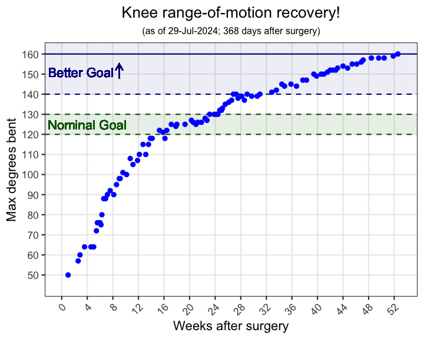

# 2023 Tibial plateau injury

In July of 2023 I suffered a bicondylar, comminuted tibial plateau fracture 😞

This is just a place holding my [knee range-of-motion data](knee-range-of-motion.tsv) and a [plotting script](plotting-ROM.R) throughout recovery 😂

## Latest plot

More details and personal journey starting here: https://www.facebook.com/811135332/posts/10167979860620333

---

